**-* NoSQLVisualizationTools is a M.Sc.Thesis on New Technologies in Computer Science from the University of Murcia. It provides a serie of projects for NoSQL Data and Schema visualization *-** 

These projects are divided into two visualization tools with different purposes: Schema visualization and Data visualization on NoSQL databases.

# Schema visualization

<figure>
	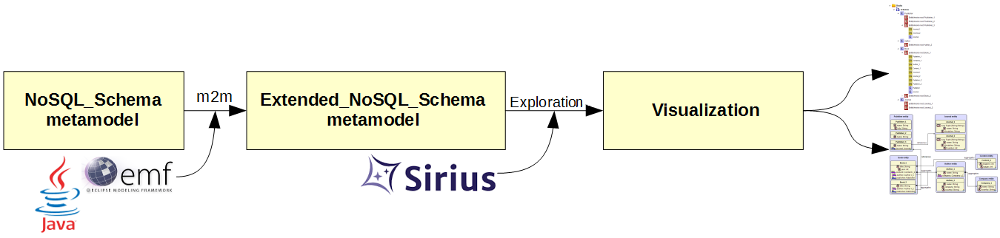
	<figcaption text-align="center">Fig1. - Schema visualization process</figcaption>
</figure>
 

The first tool is designed to represent schemas and schema versions in a friendly way using Sirius (https://eclipse.org/sirius/). Sirius is a modeling tool used to generate graphical DSLs in an easy way, but also to define a suitable representation for a given model. A NoSQL schema is a schema used to define which data and in which format is being stored in a NoSQL database. This schema is not explicitly defined but inferred by a data-oriented infererence process. As a result of this inference progress a NoSQL\_Schema model is given, and this model is the input for the visualization process.

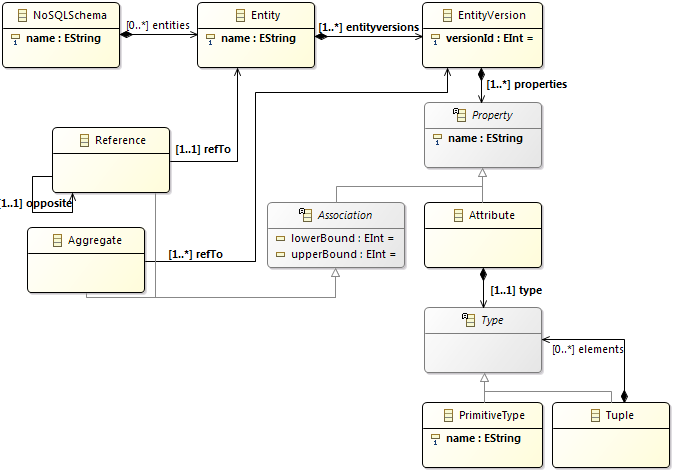

This NoSQL\_Schema model is then transformed by a m2m transformation into an Extended\_NoSQL\_Schema which is a model with the same structure as the given input model but also with inferred schema versions on it. Schema versions are generated for each root version (an entity version hich is not aggregated by anything) and is compounded by that root version and all the entities and versions aggregated and/or referenced from it.

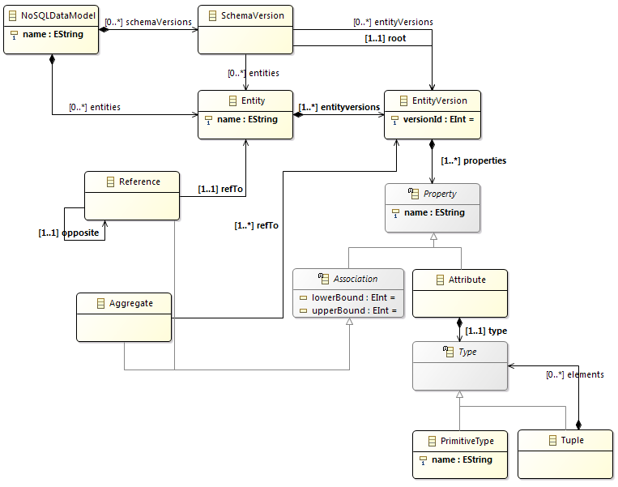

Once an Extended\_NoSQL\_Schema model is generated the Sirius workbench can be used to visualize the result. The graphic suite represents a model by giving several viewpoints representations:

* A tree representation in which all schema versions are listed as well as the entity versions (ordered alphabetically).

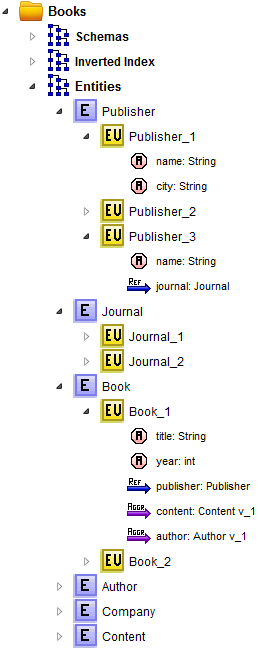

* A diagram representation to visualize the global schema with its entities, versions and attributes.

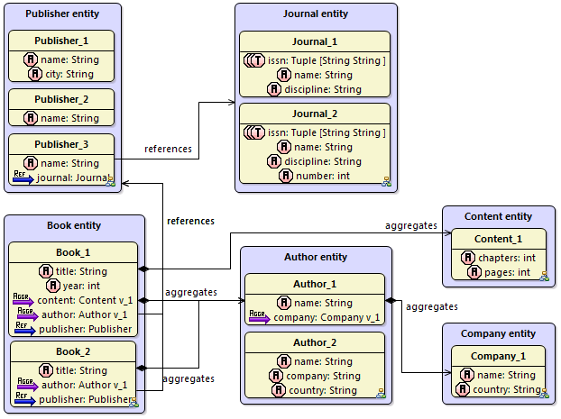

* Two diagram representations associated with each schema version.

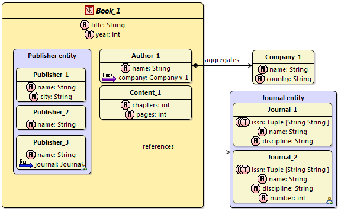

* A diagram representation associated to each entity.

The projects involved in this visualization tool are the following:

* NoSQLSchema: Project with the NoSQL\_Schema and the Extended\_NoSQL\_Schema metamodel definitions and the m2m transformation to generate Extended\_NoSQL\_Schema models.
* NoSQLSchema.edit and NoSQLSchema.editor: Projects used by the modeling infrastructure to generate an Eclipse model editor.
* NoSQLSchema.FeatureProject: The feature project to group the NoSQLSchema metamodel plugins.
* NoSQLSchema.design: The Sirius workbench project in which the viewpoints are defined.
* NoSQLSchemaVisualization.FeatureProject: The feature project in which the Sirius visualization plugin is stored.
* NoSQLSchema.UpdateSite: The update site containing the defined feature projects.

# Data visualization

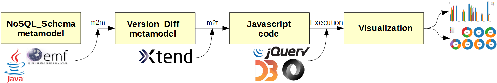

This second visualization tool is used to draw different graphics representing the data classification of a NoSQL database. Every database has a way of exporting its data as a JSON object collection. The only requirement for this process is (i) to define a NoSQL\_Schema model for the database involved and (b) making sure each object of the JSON input file has a defined id field of some kind as well as a "type" attribute indicating its type (the entity it belongs to).

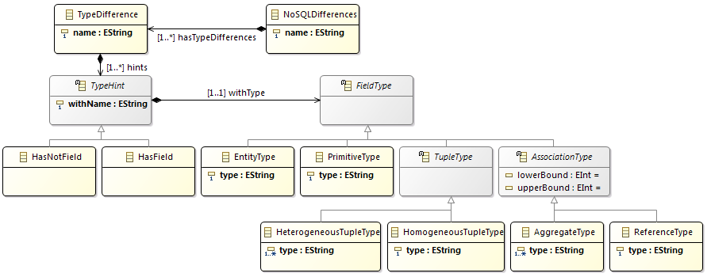

The NoSQL\_Schema model will then be transformed by a m2m transformation into a Version\_Diff model which defines, for each version entity (each JSON object) a collection of HasField and HasNotField defining how the version is composed, by which properties and with which types. Now a m2t transformation can be executed which in the end will generate JavaScript.

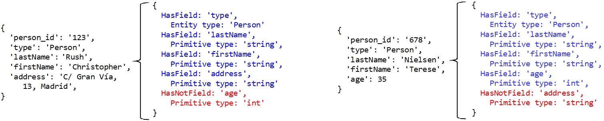

Once the m2t transformation is finished a HTML5/JS project is created with an index.html. Giving a proper JSON object collection file it is possible to classify this collection into its entities and versions and represent the results with D3.js graphics.

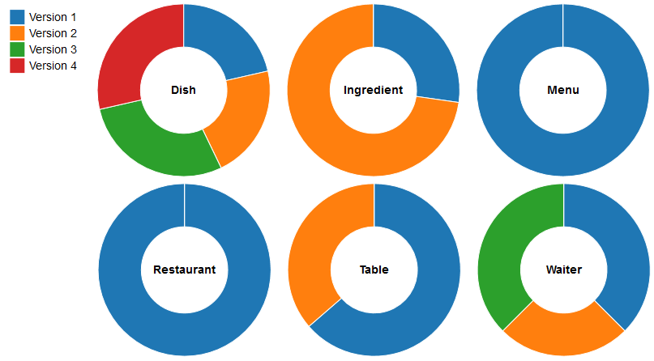

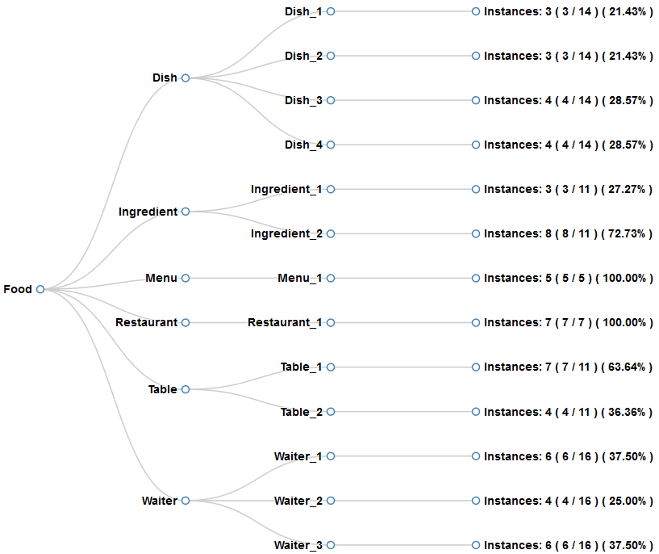

The projects involved in this visualization tool are the following:

* NoSQLDataVisualization: Project with the Version\_Diff metamodel definition. It also contains all the m2m and m2t transformations, and references the NoSQLSchema project.
* NoSQLDataVisualization.edit and NoSQLDataVisualization.editor: Projects used by the modeling infrastructure to generate an Eclipse model editor.
* NoSQLDataVisualization.FeatureProject: The feature project in which the Version\_Diff metamodel is contained.

Also in the NoSQLDataIndex project several examples can be found. Each example is contained in a folder with the JavaScript code already generated. To start each example, just open the index.html file in a web browser.

Cheers!
